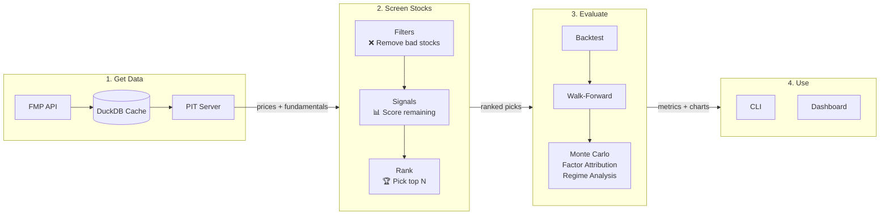

# YASS — Yet Another Stock Screener

[](https://www.python.org/downloads/)
[](LICENSE)
[](.github/workflows/ci.yml)

Screen stocks using fundamental signals, backtest with point-in-time data, and evaluate with Monte Carlo analysis. Configure signals and weights in YAML — no code changes needed.



## Quick Start

```bash
# Install
git clone https://github.com/jamesjxliao/yass.git
cd yass
poetry install

# Set up your data provider and config
cp .env.example .env  # add your FMP API key (or skip — falls back to mock data)
cp config/example.yaml config/default.yaml  # customize weights here

# Run the screener
poetry run screener screen --top-n 10

# Backtest your strategy
poetry run screener backtest

# Full evaluation (Monte Carlo, factor attribution, regime analysis)
poetry run screener evaluate

# Launch the dashboard
poetry run streamlit run app.py
```

No FMP key? No problem — the screener falls back to mock data so you can explore immediately.

## Included Signals

The repo ships with 9 signals — use them as-is or adjust weights in `config/example.yaml`:

| Signal | What It Captures |
|---|---|
| `quality_momentum` | Momentum weighted by ROE + ROIC quality |
| `margin_expansion` | Gross + operating margin improvement YoY |
| `quality_score` | Composite quality: ROE, ROIC, ROA, R&D efficiency, low debt |
| `low_leverage_growth` | Growth funded by cash flow, not debt |
| `efficiency_acceleration` | Revenue/EPS growth acceleration + SGA leverage |
| `value_composite` | Multi-factor value: earnings yield, FCF yield, EV/sales |
| `momentum` | 12-month price momentum |
| `earnings_growth` | Earnings growth rate |
| `piotroski_f_score` | Classic Piotroski F-Score |

## Configuration

Strategy config lives in `config/example.yaml`:

```yaml
universe: sp500
top_n: 10
rebalance_frequency: monthly
position_stop_loss: 0.15
hold_bonus: 1.0

filters:
  - name: market_cap_filter
    params:
      min_cap: 1_000_000_000

signals:
  - name: quality_momentum
    weight: 0.25
  - name: value_composite
    weight: 0.25
  - name: quality_score
    weight: 0.25
  - name: momentum
    weight: 0.25
```

Change the signals, adjust the weights, run `poetry run screener backtest` to see the results.

## Key Features

- **Point-in-time backtesting** — Uses data as it was known on each date, preventing lookahead bias.
- **Evaluation framework** — Monte Carlo significance testing, factor attribution (OLS), regime analysis, walk-forward validation, signal correlation matrix.
- **Plugin system** — Signals and filters auto-discovered from directories. Drop a `.py` file to add your own.
- **DuckDB caching** — Prices cached forever (immutable), fundamentals with 7-day TTL, incremental gap-fill.
- **Polars + Arrow** — Fast DataFrame operations with zero-copy interchange to DuckDB.
- **Position stop-loss** — Caps individual stock losses per rebalance period.
- **Hold bonus** — Z-score boost for current holdings to reduce turnover and improve after-tax returns.
- **Mock data provider** — Explore the full framework without an API key.
- **Streamlit dashboard** — Interactive UI with backtest explorer, signal deep-dive, and current screen tabs.

## Available Data Fields

Fields available for building signals:

| Category | Fields |
|---|---|
| **Valuation** | `market_cap`, `close`, `earnings_yield`, `fcf_yield`, `ev_to_sales` |
| **Quality** | `roe`, `roa`, `roic`, `current_ratio`, `net_debt_to_ebitda`, `income_quality` |
| **Growth** | `rev_growth_current`, `rev_growth_prior`, `eps_growth_current`, `eps_growth_prior` |
| **Margins** | `gross_margin_current`, `gross_margin_prior`, `op_margin_current`, `op_margin_prior` |
| **Efficiency** | `sga_to_revenue`, `rd_to_revenue`, `sbc_to_revenue`, `capex_to_revenue`, `cash_conversion_cycle` |
| **Price** | `momentum_12m_return`, `sma_200`, `avg_volume_20d`, `beta` |
| **Other** | `analyst_target`, `insider_buy_ratio`, `intangibles_to_assets`, `sector` |

## Writing a Custom Signal

Drop a `.py` file in `signals/`:

```python
import polars as pl
from signals._normalize import minmax

class MySignal:
    name = "my_signal"
    description = "What this signal captures"
    higher_is_better = True

    def compute(self, df: pl.DataFrame) -> pl.Series:
        roe = df["roe"].cast(pl.Float64).fill_null(0.0)
        fcf = df["fcf_yield"].cast(pl.Float64).fill_null(0.0)
        return (minmax(roe) * minmax(fcf)).sqrt()
```

Add it to your config and backtest. No core code changes needed.

## Architecture

```
├── signals/              # Signal plugins (drop .py files here)
├── filters/              # Filter plugins (drop .py files here)
├── config/               # Strategy configuration (YAML)
├── src/screener/
│   ├── data/             # Data providers, caching, PIT queries
│   ├── engine/           # Pipeline, ranking, output
│   ├── backtest/         # Runner, walk-forward, metrics
│   ├── evaluation/       # Monte Carlo, factor attribution, charts
│   └── plugins/          # Plugin discovery and registry
├── tests/                # Test suite
└── app.py                # Streamlit dashboard
```

## Commands

```bash
poetry run screener list-plugins          # Show discovered filters & signals
poetry run screener screen --top-n 10     # Run screener
poetry run screener backtest              # Run backtest
poetry run screener fetch-history         # Fetch historical data from FMP
poetry run screener evaluate              # Full signal evaluation
poetry run streamlit run app.py           # Launch dashboard
```

## Development

```bash
# Run tests
poetry run pytest -v

# Lint
poetry run ruff check .
```

## Contributing

Contributions are welcome.

1. Fork the repo
2. Add your signal/filter as a new `.py` file
3. Add tests
4. Run `poetry run pytest -v && poetry run ruff check .`
5. Open a PR

## License

[Apache 2.0](LICENSE)
