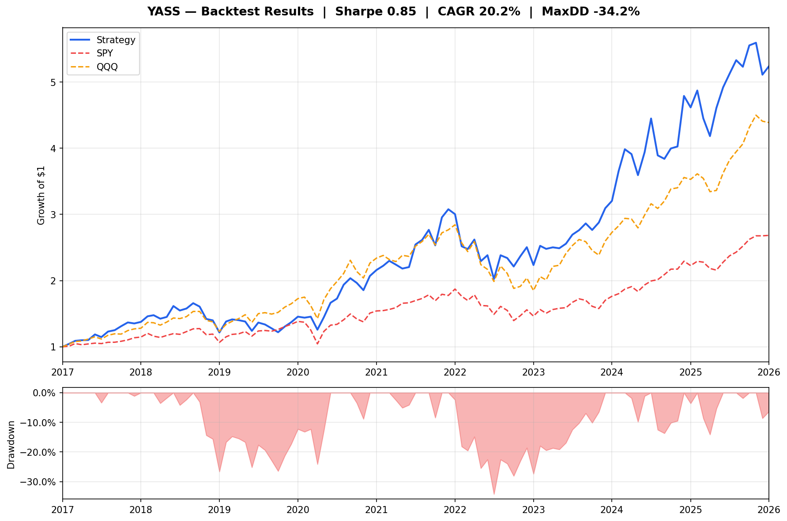
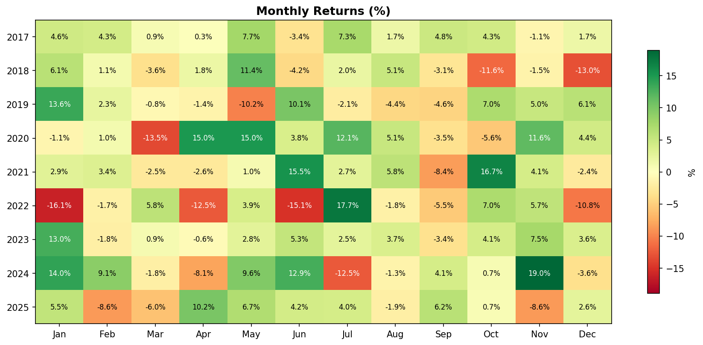
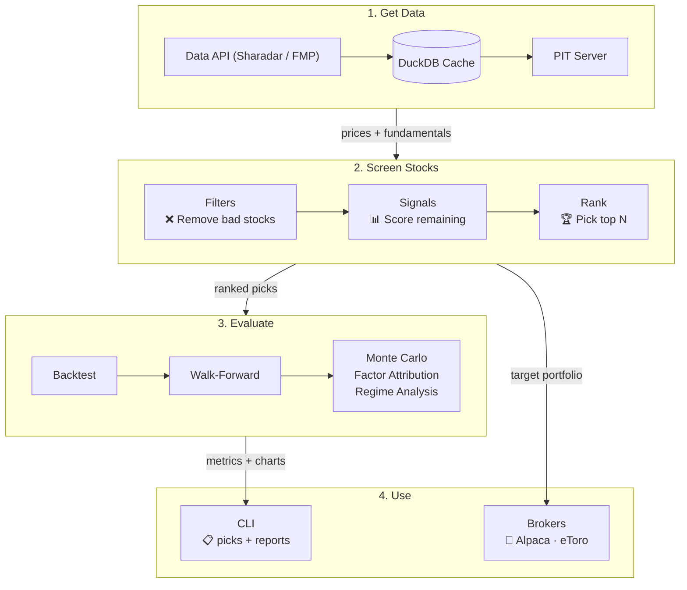

# YASS — Yet Another Stock Screener

[](https://www.python.org/downloads/)
[](LICENSE)
[](https://github.com/jamesjxliao/yass/actions/workflows/ci.yml)

Screen stocks using fundamental signals, backtest with point-in-time data, and evaluate with Monte Carlo analysis. Configure signals and weights in YAML — no code changes needed.

### Sample Backtest (2017–2026, using included `example.yaml`)





> **Read the numbers honestly:** these are in-sample results (10 bps round-trip costs, survivorship-free S&P 500 membership, Sharadar data). On 108 monthly returns, the stationary-block-bootstrap 90% confidence interval on that Sharpe is **[0.37, 1.38]** — a 9-year backtest is a noisy point estimate, not a promise. The interval comes from `src/screener/evaluation/robustness.py`; `poetry run screener evaluate` reproduces the charts.



## Quick Start

```bash
# Install
git clone https://github.com/jamesjxliao/yass.git
cd yass
poetry install

# Set up your data provider and config
cp .env.example .env  # add your data API key (or skip — falls back to mock data)
cp config/example.yaml config/default.yaml  # customize weights here

# Run the screener
poetry run screener screen --top-n 10

# Backtest your strategy
poetry run screener backtest

# Full evaluation (Monte Carlo, factor attribution, regime analysis)
poetry run screener evaluate
```

No API key? No problem — the screener falls back to mock data so you can explore immediately.

> **Data provider:** YASS supports [Sharadar (Nasdaq Data Link)](https://data.nasdaq.com/) and [Financial Modeling Prep (FMP)](https://financialmodelingprep.com/) for market data. Set `NASDAQ_DATA_LINK_API_KEY` or `FMP_API_KEY` in `.env` — auto-selection prefers Sharadar; `DATA_PROVIDER=sharadar|fmp|mock` forces a choice. Without a key, mock data is used. Don't point both providers at the same DuckDB file — their caches must not mix.

## Included Signals

The repo ships with 8 signals — use them as-is or adjust weights in `config/example.yaml`:

| Signal | What It Captures |
|---|---|
| `piotroski_f` | Financial strength checklist (profitability, leverage, efficiency) |
| `momentum_12m` | 12-month price momentum |
| `low_leverage_growth` | Growth funded by cash flow, not debt |
| `quality_score` | Composite quality: ROE, ROIC, ROA, R&D efficiency, low debt |
| `margin_expansion` | Gross + operating margin improvement YoY |
| `quality_at_discount` | Beaten-down quality stocks with FCF + low debt |
| `quality_midcap` | Mid-cap quality + value blend: ROE, ROIC, ROA, low debt, earnings yield |
| `quality_at_discount_midcap` | Mid-cap variant of quality-at-discount |

## Configuration

Strategy config lives in `config/example.yaml`:

```yaml
universe: sp500
top_n: 10
rebalance_frequency: monthly
position_stop_loss: 0.0
hold_bonus: 1.0

filters:
  - name: market_cap_filter
    params:
      min_cap: 1_000_000_000

signals:
  - name: piotroski_f
    weight: 0.30
  - name: momentum_12m
    weight: 0.25
  - name: quality_score
    weight: 0.25
  - name: low_leverage_growth
    weight: 0.20
```

Signal names must match the `name` attribute on the signal class (e.g. `momentum_12m`, not `momentum`); the loader raises if a name isn't found.

An optional top-level `weighting: equal | inverse_vol` key (default `equal`) sets position sizing: `inverse_vol` sizes each pick proportional to 1/`realized_vol_20d`, applied consistently across the backtest, broker rebalancing, and the `target_weight` column in screen output.

Change the signals, adjust the weights, run `poetry run screener backtest` to see the results.

## Key Features

- **Point-in-time backtesting** — Uses data as it was known on each date, preventing lookahead bias.
- **Evaluation framework** — Monte Carlo significance testing, factor attribution (OLS), regime analysis, walk-forward validation, signal correlation matrix.
- **Plugin system** — Signals and filters auto-discovered from directories. Drop a `.py` file to add your own.
- **DuckDB caching** — Prices cached forever (immutable), fundamentals with 7-day TTL, incremental gap-fill.
- **Polars + Arrow** — Fast DataFrame operations with zero-copy interchange to DuckDB.
- **Position stop-loss** — Optional per-period stop-loss (disabled by default — intraday whipsaw hurts momentum strategies).
- **Hold bonus** — Z-score boost for current holdings to reduce turnover and improve after-tax returns.
- **Position weighting** — equal-weight or inverse-volatility sizing (`weighting` config key), identical in backtest and live orders.
- **Broker integration** — Rebalance via Alpaca or eToro with dry-run safety and trade logging.
- **Live tracking** — `screener track` compares realized, deposit-adjusted account returns against the model returns of your logged holdings — the true out-of-sample record.
- **Mock data provider** — Explore the full framework without an API key.

## Available Data Fields

Fields available for building signals:

| Category | Fields |
|---|---|
| **Valuation** | `market_cap`, `close`, `earnings_yield`, `fcf_yield`, `ev_to_sales` |
| **Quality** | `roe`, `roa`, `roic`, `current_ratio`, `net_debt_to_ebitda`, `income_quality` |
| **Growth** | `rev_growth_current`, `rev_growth_prior`, `eps_growth_current`, `eps_growth_prior` |
| **Margins** | `gross_margin_current`, `gross_margin_prior`, `op_margin_current`, `op_margin_prior` |
| **Efficiency** | `sga_to_revenue`, `rd_to_revenue`, `sbc_to_revenue`, `capex_to_revenue`, `cash_conversion_cycle` |
| **Price** | `momentum_12m_return`, `sma_200`, `realized_vol_20d`, `avg_volume_20d`, `beta` |
| **Other** | `analyst_target`, `insider_buy_ratio`, `intangibles_to_assets`, `sector` |

> `beta`, `analyst_target`, and `insider_buy_ratio` are **FMP-only** — they are absent under Sharadar (the preferred provider), so signals using them should guard on column presence.

## Writing a Custom Signal

Drop a `.py` file in `signals/`:

```python
import polars as pl
from signals._normalize import minmax

class MySignal:
    name = "my_signal"
    description = "What this signal captures"
    higher_is_better = True

    def compute(self, df: pl.DataFrame) -> pl.Series:
        roe = df["roe"].cast(pl.Float64).fill_null(0.0)
        fcf = df["fcf_yield"].cast(pl.Float64).fill_null(0.0)
        return (minmax(roe) * minmax(fcf)).sqrt()
```

Add it to your config and backtest. No core code changes needed.

## Architecture

```
├── signals/              # Signal plugins (drop .py files here)
├── filters/              # Filter plugins (drop .py files here)
├── config/               # Strategy configuration (YAML)
├── src/screener/
│   ├── data/             # Data providers, caching, PIT queries
│   ├── engine/           # Pipeline, ranking, output
│   ├── backtest/         # Runner, walk-forward, metrics
│   ├── evaluation/       # Monte Carlo, factor attribution, charts
│   ├── trading/          # Broker integrations (Alpaca, eToro, Robinhood)
│   └── plugins/          # Plugin discovery and registry
└── tests/                # Test suite
```

## Commands

```bash
poetry run screener list-plugins          # Show discovered filters & signals
poetry run screener screen --top-n 10     # Run screener
poetry run screener backtest              # Run backtest
poetry run screener fetch-history         # Fetch historical data into DuckDB
poetry run screener evaluate              # Full signal evaluation
poetry run screener trade-alpaca          # Rebalance via Alpaca (dry run)
poetry run screener trade-etoro           # Rebalance via eToro (dry run)
poetry run screener track                 # Live-vs-backtest tracking report
```

## Development

```bash
# Run tests
poetry run pytest -v

# Lint
poetry run ruff check .
```

## Contributing

Contributions are welcome.

1. Fork the repo
2. Add your signal/filter as a new `.py` file
3. Add tests
4. Run `poetry run pytest -v && poetry run ruff check .`
5. Open a PR

## License

[Apache 2.0](LICENSE)

## Disclaimer

This software is for educational and informational purposes only. It is not investment advice. Past backtest performance does not guarantee future results. Always do your own research before making investment decisions.
